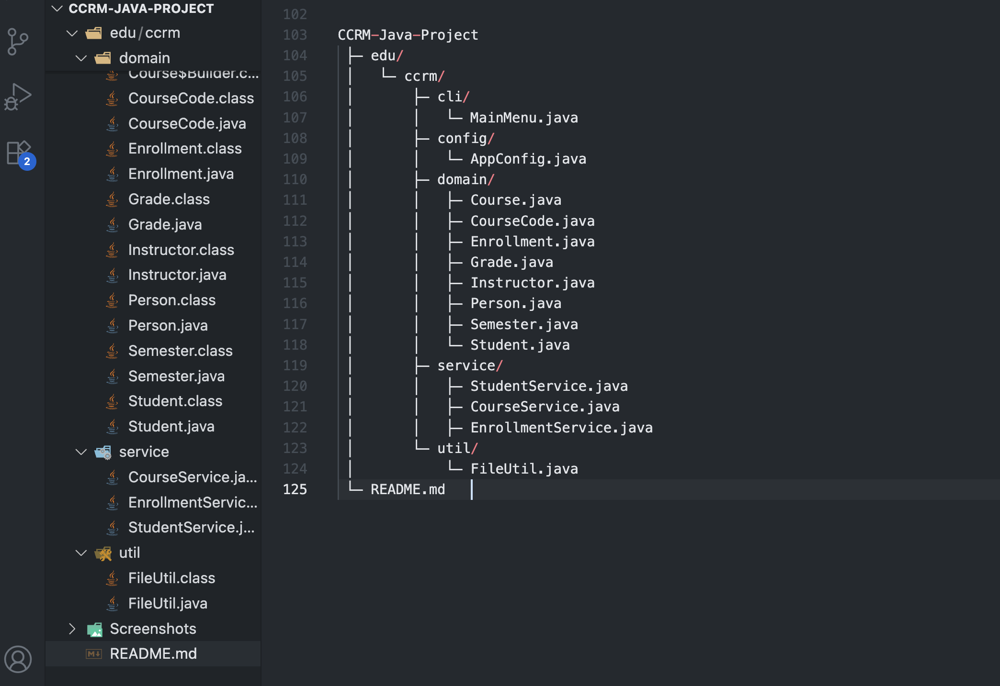
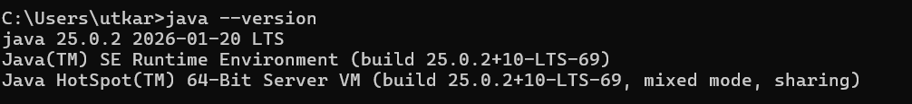
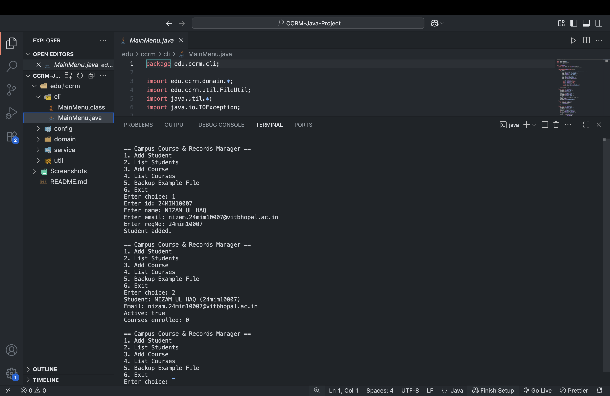
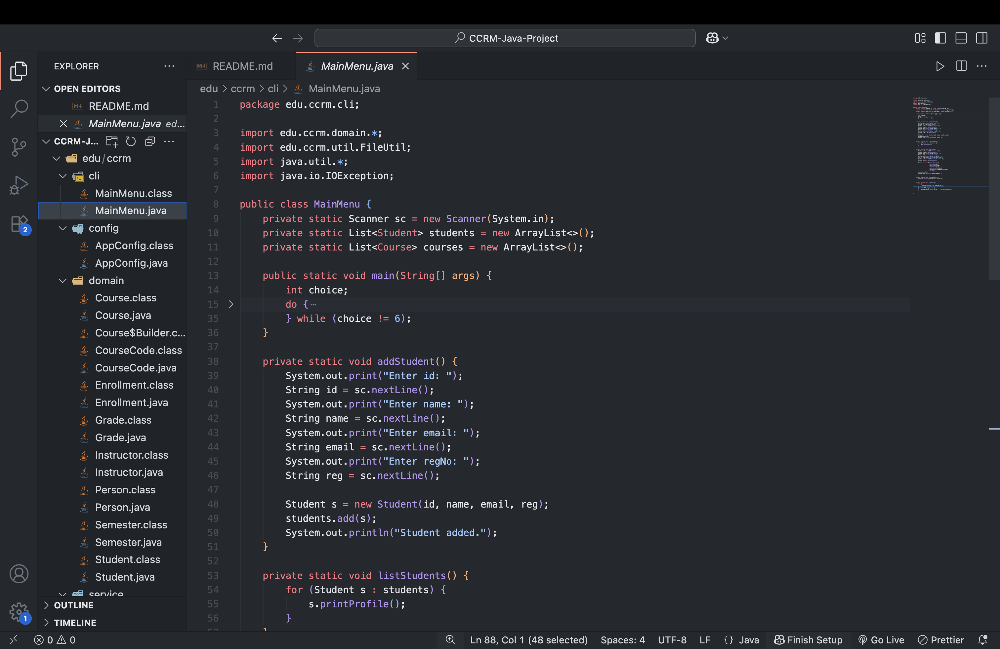

# Campus Course & Records Manager (CCRM)

**Shreyas Agarwal (25BAI11356)**

This is my project for Programming in Java — a console app for managing students, courses, and enrollments on a campus. I built it to practice the OOP concepts we covered in class: inheritance, abstraction, polymorphism, enums, the Builder and Singleton patterns, and file handling with NIO.2.

## Project Structure

```
java-ccrm-vityarthi-main/
├─ ccrm/
│  ├─ cli/       ← entry point and menu (MainMenu.java)
│  ├─ config/    ← app configuration
│  ├─ domain/    ← core classes (Student, Course, etc.)
│  ├─ service/   ← business logic
│  └─ util/      ← helper classes
├─ screenshots/  ← screenshots showing it working
├─ sample.txt    ← sample file used for the backup demo
├─ .gitignore
└─ README.md
```



## What you need

- Java 17 or newer
- A terminal, or an IDE like VS Code (with the Java Extension Pack) or Eclipse

If you need to install Java, grab the JDK and check it installed correctly:


```
java -version
javac -version
```



## Running it from the command line

1. Open a terminal in the project root.
2. Compile the source:

   **Linux/macOS:**
   ```
   mkdir -p out
   javac -d out $(find ccrm -name "*.java")
   ```

   **Windows PowerShell:**
   ```
   New-Item -ItemType Directory -Force out | Out-Null
   javac -d out (Get-ChildItem -Recurse -Filter *.java | ForEach-Object { $_.FullName })
   ```

3. Run it:
   ```
   java -cp out ccrm.cli.MainMenu
   ```



### Running with assertions on (optional)

A few classes use assertions to validate input, like:
```java
assert credits > 0 : "Credits must be positive";
```
To turn these on at runtime:
```
java -ea -cp out ccrm.cli.MainMenu
```

## Running it from an IDE

**VS Code:** open the project folder with the Java Extension Pack installed, then run `ccrm/cli/MainMenu.java` directly.

**Eclipse:**
1. File → New → Java Project
2. Name it `CCRM-Java-Project`
3. Import the existing `ccrm/` package structure
4. Run `MainMenu.java`


## OOP concepts in this project

| Concept | Where | Why it's there |
|---|---|---|
| Encapsulation | `Student.java` (private fields) | Keeps internal state protected |
| Inheritance | `Person → Student, Instructor` | Shared behavior across related classes |
| Abstraction | `Person.java` (abstract class) | A common interface for subclasses to implement |
| Polymorphism | `printProfile()` overrides | Same method call, different behavior depending on the object |
| Immutable class | `CourseCode.java` | Predictable, thread-safe values |
| Nested class | `Course.Builder` | Keeps construction logic next to the class it builds |
| Enums | `Grade.java`, `Semester.java` | Type-safe fixed sets of values |
| Design patterns | Singleton, Builder | Standard patterns for controlled object creation |
| File I/O | `FileUtil.java` (NIO.2) | Handles the backup feature |
| Date/Time API | Student admission dates | Cleaner than the old `Date` class |

## Screenshots

A few more showing it working end to end:

**Backup feature**


## Where this could go next

If I keep working on this, the next steps would probably be:
- Hooking it up to a real database (JDBC) instead of in-memory storage
- A basic web interface or REST API on top of the existing service layer
- More reporting features

The package layout (`domain`, `service`, `util` kept separate) was mainly so that adding things like this later doesn't mean restructuring what's already there.
